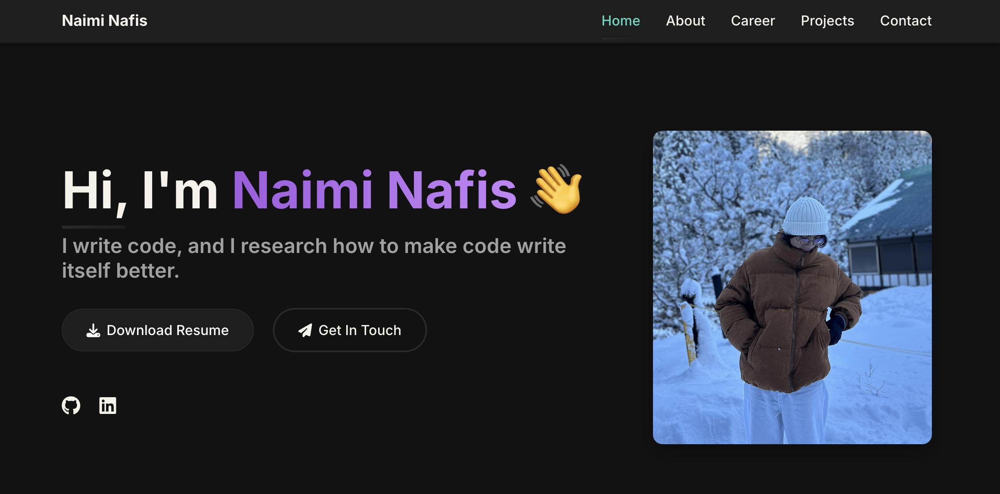

# Naimi Nafis - Portfolio

A modern, responsive personal portfolio website showcasing my projects and skills.

## 🚀 Live Demo

[View Live Demo](https://naiminafis.github.io) <!-- Replace with your actual deployment URL -->

 <!-- Consider adding a screenshot of your site -->

## ✨ Features

- Responsive design optimized for all devices
- Dark theme with modern UI elements
- Interactive project cards with GitHub links
- Contact form for easy communication
- Animated section transitions

## 🛠️ Built With

- HTML5
- CSS3 (Custom properties, Flexbox, CSS Grid)
- Vanilla JavaScript (ES6+)
- Font Awesome icons
- Google Fonts

## 🔧 Quick Start

```bash
# Clone the repository
git clone https://github.com/NaimiNafis/portfolio.git

# Navigate to the directory
cd portfolio

# Open in your browser
open index.html
```

## 📋 Project Structure

The project follows a component-based structure with separate CSS files for each section:

```
portfolio/
├── css/          # Modular CSS with component-based styling
├── js/           # JavaScript modules for interactive elements
├── assets/       # Images, documents, and other static files
└── index.html    # Main HTML file
```

## 📱 Contact

- GitHub: [@NaimiNafis](https://github.com/NaimiNafis)
- LinkedIn: [Naimi Nafis](https://www.linkedin.com/in/naimi-nafis-83845a274/)
- Email: naiminafis@gmail.com
